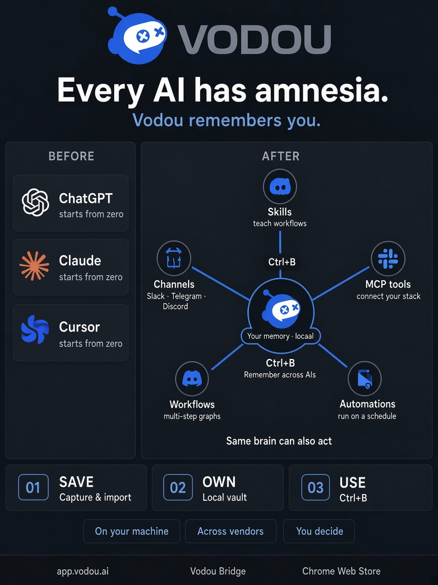

# Vodou

**Your AI harness** — local-first memory, skills, tools, and workflows you own and extend.

Not another chatbot. Vodou sits **under** the places you already work — web AIs, IDEs, CLIs, desktop MCP clients, messaging, and its own Console — with one durable brain on your machine, then arms (MCP tools), playbooks (skills), and scheduling — all **expandable by you**.

> Bring your models. Bring your servers. Bring your workflows. Vodou is the harness that holds them together — and follows you from ChatGPT and Claude.ai to Cursor, Claude Code, and Codex without starting from zero.

<p align="center">
  <a href="https://vodou.ai"><strong>vodou.ai</strong></a> ·
  <a href="https://app.vodou.ai"><strong>App</strong></a> ·
  <a href="https://chromewebstore.google.com/detail/vodou-bridge/ehlanbbiaeelnimkakfffehoahimkjjf"><strong>Chrome Bridge</strong></a> ·
  <a href="https://github.com/VodouAI/OS"><strong>Open source</strong></a> ·
  <a href="https://blog.vodou.ai"><strong>Blog</strong></a>
</p>

<p align="center">
  
</p>

<video src="https://github.com/user-attachments/assets/c0dce88e-285b-4a58-a065-1fd9c03a6654" controls="controls" autoplay muted style="max-width: 730px">
</video>

---

## The harness, not the cage

| Layer | What it is | You can expand it |
|---|---|---|
| **Memory** | Facts, prefs, docs, imports — local DB on your machine | Import sources, vaults, pins, leak policy, what follows you into which surface |
| **Skills** | Guided workflows with stopping points — expert playbooks, not one-shot prompts | Add, edit, import, and share skills; wire them to the tools you care about |
| **MCP tools** | Real actions: mail, calendar, browser, tickets, files, APIs… | Connect **any** MCP server (stdio, HTTP, …). Your catalog, not a fixed vendor list |
| **Scripts & jobs** | Longer-running work with status and control | Register your own scripts and automation |
| **Surfaces** | Bridge (web AIs), IDE/CLI hooks, Console, messaging, OpenAI-compatible API, MCP host | Attach the clients you use; scope what each one can see |
| **Scheduler / loops** | Heartbeats, reminders, things Vodou notices for you | Turn lanes on/off; decide what runs and where it reports |

Everything is meant to be **yours to customize**: which model answers, which tools are allowed, which vault an agent may search, which skill fires, what never leaves the machine.

---

## What that feels like day to day

**Memory that follows you**  
Press **Ctrl+B** in ChatGPT, Claude, Gemini, and other supported sites — relevant context lands in *their* composer. The same brain reaches Cursor, Claude Code, and other coding agents through hooks and rules files. Import ChatGPT / Claude / Obsidian history; pin and correct; keep provenance so *your* facts outrank throwaway imports.

**Skills when a workflow matters**  
Say what you want done and get a visible plan — run once, edit, save as a reusable skill, or schedule it. Mid-run decisions stop and ask you. Skills are files you can read, change, and grow.

**MCP when you need arms**  
Connect the apps and servers you already trust. Vodou routes natural language to tools and can run them in parallel. Add a new MCP server → new capability. No waiting on our roadmap for your stack.

**A host, not only a client**  
Attach Claude Desktop, Cursor, VS Code, Windsurf, Zed, or your own scripts as MCP clients — each with identity, scope, audit trail, and a kill switch. Or point anything OpenAI-compatible at your local gateway and get your context for free.

**Messaging & schedule**  
Text the same brain from Telegram, Slack, Discord, and more. Heartbeats and automations so work continues when you’re not staring at a chat.

**Receipts & honesty**  
Every turn can leave a receipt (memories · tools · skills). Conflicts surface for you to settle. Graders say **`unknown`** when there’s no evidence — never a fake green light.

**Your keys, or local**  
Frontier APIs, or models that never leave your box. Conversation content and memory stay on-device by default.

---

## How it fits together

```text
  Web AIs · IDEs · CLIs · Console · messaging · MCP clients
              │         Bridge · hooks · channels · MCP · API
              ▼
  ┌──────────────────────────────────────────────────────┐
  │  Vodou on your machine  (the harness)                │
  │                                                      │
  │  Memory  ←→  Skills  ←→  MCP tools  ←→  Scripts      │
  │       Scheduler · vaults · policy · receipts         │
  │       Your models · your servers · your rules        │
  └──────────────────────────────────────────────────────┘
```

1. **Capture** — chats, docs, pins → local memory.  
2. **Orchestrate** — skills + MCP + scripts, under your policy.  
3. **Follow** — inject and act on the surfaces you already use.  
4. **Prove** — receipts and evidence, not vibes.

---

## Quick start

**macOS / Linux:**

```bash
curl -fsSL https://raw.githubusercontent.com/VodouAI/OS/main/install-vodou.sh | bash
```

**Windows (beta):**

```powershell
irm https://raw.githubusercontent.com/VodouAI/OS/main/install-vodou.ps1 | iex
```

Then finish the wizard at [app.vodou.ai](https://app.vodou.ai) (account licenses the engine — **memory stays local**), install **[Vodou Bridge](https://chromewebstore.google.com/detail/vodou-bridge/ehlanbbiaeelnimkakfffehoahimkjjf)**, pin a fact, open any supported AI, hit **Ctrl+B**.

Add an MCP server when you want new arms. Drop a skill when you want a playbook. Grow the harness — don’t wait for a single vendor’s memory feature.

Deep docs & architecture: **[VodouAI/OS](https://github.com/VodouAI/OS)**.

---

## Repositories

| Repo | What it is |
|---|---|
| **[OS](https://github.com/VodouAI/OS)** | Public open tree — install, Console, Bridge, docs (start here) |
| **[vodou-core](https://github.com/VodouAI/vodou-core)** | Engine binaries / core releases |
| **[vodou-skills-catalog](https://github.com/VodouAI/vodou-skills-catalog)** | Skills you can browse and extend |
| **[lenses-directory](https://github.com/VodouAI/lenses-directory)** | Community page-lenses — PRs welcome |

---

## Why a harness

Models get smarter every quarter. Chat UIs multiply. Built-in “memory” stays trapped in one product. Exporters move transcripts; they don’t give you **governed context + tools + workflows** under ChatGPT *and* Claude *and* your coding agent.

Vodou’s bet: **own the harness** — memory, skills, MCP, policy — on your machine. Swap models. Add servers. Write skills. Keep the brain.

Public alpha. Built for people who live in multiple AIs and want one stack they can actually extend.

---

## Links

- Product: [vodou.ai](https://vodou.ai) · [app.vodou.ai](https://app.vodou.ai)  
- Bridge: [Chrome Web Store](https://chromewebstore.google.com/detail/vodou-bridge/ehlanbbiaeelnimkakfffehoahimkjjf)  
- Source: [github.com/VodouAI/OS](https://github.com/VodouAI/OS)  
- Blog: [blog.vodou.ai](https://blog.vodou.ai)  
- Privacy: [app.vodou.ai/privacy](https://app.vodou.ai/privacy.html)

<p align="center">
  <sub>Harness · Local-first · Model-agnostic · Expandable by you</sub>
</p>
